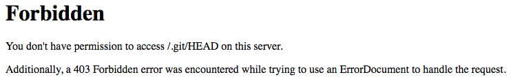

## Pendahuluan

Sungguh memalukan sekali ketika tadi pagi buka email, ada pesan masuk menyatakan website [jaspis.me](https://jaspis.me) ini, menyatakan akses folder .git nya terbuka secara bebas. 🤦‍♂ Artinya informasi *logs personal* dan bahkan hal sensitif lainnya bisa dilihat secara terbuka. Ya walaupun website ini statis dan tidak ada hal penting ke database atau hal krusial lainnya, tetap saja hal itu sangat menemplak.

Dan saya melupakan masalah keamanan (*security*), akan tetapi biarlah hal ini membuat saya menjadi pengalaman dalam menangani dan bertindak bila suatu website ke production.

Saya sungguh berterima kasih sekali kepada Vladimir Smitka - [@smitka](https://twitter.com/smitka) seorang peneliti independent dari Negara Ceko yang scanning besar-besaran terhadap website yang akses .git repositori nya terbuka ke publik, dan website ini terindikasi salah satunya. 😑

## Mengecek folder .git terbuka

Bagi anda yang ingin mengetahui bahwa folder .git anda bisa diakses secara publik adalah dengan membuka `/.git/logs/HEAD` setelah website anda.

Jika menampilkan data logs git repository anda, maka itu artinya terbuka. Seharunya mengembalikan tampilan `403` seperti dibawah ini.



## Menambah kode blok hak akses
Oleh karenanya setelah itu saya langsung menambah code pada `.httaccess`, karena saya menggunakan Apache.

``` apacheconf
RewriteRule "(^|/)\.(?!well-known\/)" - [F]
```

Kalau anda menggunakan Nginx

``` nginx
location ~ /\.(?!well-known\/) {
    deny all;
}
```

Kalau anda menggunakan apache22
``` apacheconf
<Directory ~ "/\.(?!well-known\/)">
    Order deny,allow
    Deny from all
</Directory>
```

Kalau anda menggunakan apache24
``` apacheconf
<Directory ~ "/\.(?!well-known\/)">
    Require all denied
</Directory>
```

Selesai  🎉 Ya mungkin segitu dulu ya.   😃